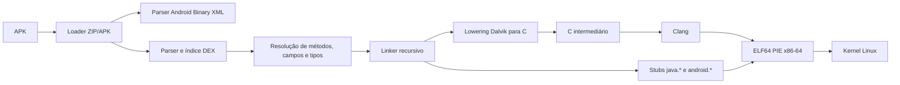

<div align="center">

# WineDroid

### Compilação AOT de bytecode Android para executáveis Linux nativos

**APK → DEX → C → ELF x86-64**

[](https://www.rust-lang.org/)
[](LICENSE)
[](#requisitos)
[](#estado-atual)

O WineDroid é uma camada experimental de compatibilidade que pesquisa como
executar código de aplicativos Android no Linux **sem iniciar um sistema
Android completo, sem máquina virtual e sem contêiner Android**.

</div>

> [!IMPORTANT]
> O WineDroid ainda não é um launcher Android de uso geral. O projeto já
> produz e executa ELF nativo a partir de métodos DEX reais, mas grande parte
> de `java.*`, `android.*`, JNI, Binder e interface gráfica ainda não foi
> implementada.

## Sumário

- [Objetivo](#objetivo)
- [Estado atual](#estado-atual)
- [Marco comprovado com o SukiSU](#marco-comprovado-com-o-sukisu)
- [Como funciona](#como-funciona)
- [Recursos implementados](#recursos-implementados)
- [Requisitos](#requisitos)
- [Compilação](#compilação)
- [Uso](#uso)
- [Testes](#testes)
- [Estrutura do repositório](#estrutura-do-repositório)
- [Limitações atuais](#limitações-atuais)
- [Próximos marcos](#próximos-marcos)
- [Segurança](#segurança)
- [Licença](#licença)

## Objetivo

O objetivo do WineDroid é construir uma ponte nativa entre aplicativos Android
e o desktop Linux.

Em vez de iniciar uma imagem completa do Android, o projeto:

1. abre e analisa o APK;
2. interpreta o manifesto Android Binary XML;
3. lê as estruturas DEX e resolve métodos, campos, strings e tipos;
4. seleciona métodos Dalvik compatíveis;
5. converte esses métodos para código C;
6. usa o Clang para gerar um executável ELF64 PIE;
7. executa o resultado diretamente pelo kernel Linux;
8. encaminha chamadas ainda não implementadas para stubs do runtime.

A meta de longo prazo é substituir progressivamente esses stubs por
implementações nativas de `java.*`, `android.*` e serviços do host.

## Estado atual

O WineDroid já possui uma base funcional de compilação AOT e ligação
recursiva.

| Área | Estado |
|---|---|
| Leitura de ZIP/APK | Implementada |
| Android Binary XML | Implementação parcial funcional |
| Índices e corpos DEX | Implementados |
| Inspeção de classes, métodos e bibliotecas nativas | Implementada |
| Dalvik → C | Implementação experimental funcional |
| C → ELF64 PIE x86-64 | Implementada com Clang |
| Execução direta do ELF no Linux | Implementada |
| Objetos por handles e campos compartilhados | Implementados parcialmente |
| Ligação de múltiplos métodos no mesmo processo | Implementada |
| Expansão recursiva de chamadas internas | Implementada |
| ABI genérica de argumentos Dalvik | Implementada |
| `packed-switch` (`0x2b`) | Implementado |
| `sparse-switch` (`0x2c`) | Ainda não implementado |
| `throw` (`0x27`) | Lowering implementado |
| Tabelas `try/catch` e captura de exceções | Ainda não implementadas |
| Framework Android real | Ainda não implementado |
| Janela de `Activity` | Ainda não implementada |
| JNI, Bionic e Binder | Ainda não implementados |
| Tradução ARM/ARM64 → x86-64 | Ainda não implementada |

## Marco comprovado com o SukiSU

O APK usado atualmente como alvo de integração é:

```text
SukiSU v4.1.3 — build 40796
```

Na validação realizada após o commit de `packed-switch`, o WineDroid produziu
um ELF Linux nativo com o seguinte relatório:

```text
Métodos raiz:                              4
Métodos internos ligados:                166
Chamadas externas mantidas em stub:      176
Métodos internos rejeitados:               6
Chamadas limitadas pela profundidade:    334
Profundidade máxima usada:                 3
Packed-switch reais no C:                  1
Cases traduzidos nesse switch:            27
Formato final:                    ELF64 PIE x86-64
```

Os quatro métodos raiz são:

```text
Lcom/sukisu/ultra/KernelSUApplication;-><init>()V
Lcom/sukisu/ultra/KernelSUApplication;->onCreate()V
Lcom/sukisu/ultra/ui/MainActivity;-><init>()V
Lcom/sukisu/ultra/ui/MainActivity;->onCreate(Landroid/os/Bundle;)V
```

Durante a execução, o ELF percorre código real do APK, inicializa objetos,
segue chamadas internas e chega à camada de reflexão. O ponto atual termina
com:

```text
Ljava/lang/NoSuchMethodException;
[WineDroid] throw handle=25
status: 103
```

Esse status não indica falha na geração do ELF. Ele representa um caminho
Dalvik de `throw` alcançado porque operações como
`Class.getDeclaredMethod`, `Method.invoke` e partes de `sun.misc.Unsafe`
ainda dependem de stubs incompletos.

> [!NOTE]
> As métricas acima são um retrato de uma configuração específica:
> profundidade `3`, teto de `192` métodos e o APK citado. Elas devem crescer
> ou mudar conforme novos opcodes e APIs forem implementados.

## Como funciona



### ABI genérica de métodos

A ABI antiga aceitava apenas `this` e um argumento. A ABI atual encaminha
todos os registradores de entrada:

```c
wd_value method(uint32_t argc, const wd_value *args);
```

O frame Dalvik recebe os argumentos no final do conjunto de registradores:

```text
incoming_start = registers_size - ins_size
v[incoming_start + i] = args[i]
```

Isso permite ligar:

- métodos estáticos com argumentos;
- métodos de instância;
- construtores;
- chamadas com vários parâmetros;
- referências e valores primitivos;
- palavras de valores Dalvik wide.

### Linker recursivo

O linker parte dos quatro métodos de ciclo de vida do SukiSU e percorre
referências `invoke-*`.

Quando o alvo interno é compatível, ele é compilado dentro do mesmo ELF.
Quando ainda não é compatível, a chamada permanece em um stub externo.

Proteções atuais:

```text
profundidade padrão:       4
teto padrão do grafo:    192 métodos
tamanho máximo:         1024 code units por método
```

Métodos incompatíveis são rejeitados individualmente sem impedir a expansão
dos demais ramos do grafo.

### Controle de fluxo

O backend já baixa branches Dalvik para labels e `goto` em C.

O opcode `packed-switch` (`0x2b`) também é interpretado. O compilador:

1. localiza o `packed-switch-payload`;
2. lê `size` e `first_key`;
3. resolve cada offset relativo à instrução de switch;
4. valida os destinos;
5. gera um `switch` C;
6. trata payloads DEX como dados, não como instruções executáveis.

### Exceções

A presença de `throw` (`0x27`) não bloqueia mais um método inteiro. O lowering
chama `wd_throw` apenas quando aquele caminho é realmente alcançado.

Ainda não existem:

- leitura completa das tabelas de exceção do `code_item`;
- busca de handlers compatíveis;
- propagação entre frames;
- semântica completa de `try/catch/finally`.

Por enquanto, um `throw` não capturado encerra o ELF com status `103`.

## Recursos implementados

### Inspeção de APK

O comando `winedroid inspect` informa:

- tamanho e entradas do APK;
- formato do manifesto;
- package name e versão;
- SDK mínimo e alvo;
- `Application` e launcher `Activity`;
- activities e permissões;
- arquivos DEX;
- quantidade de classes, métodos, campos, protótipos e strings;
- bibliotecas nativas e ABI;
- presença de `resources.arsc`;
- entradas de assinatura v1;
- avisos encontrados durante o parsing.

### Compilação AOT

O compilador suporta diferentes níveis de teste:

- programa Dalvik sintético;
- método isolado extraído de DEX;
- método isolado extraído de APK;
- método com objetos e chamadas externas;
- quatro métodos do ciclo de vida em um ELF;
- grafo recursivo de métodos internos.

### Runtime nativo experimental

O código C gerado contém atualmente estruturas para:

- frame de registradores Dalvik;
- valores e handles de objetos;
- armazenamento de campos;
- criação experimental de objetos;
- dispatch de métodos internos por `method_id`;
- stubs para métodos externos;
- logs de chamadas e alocações;
- caminho controlado para `throw`.

## Requisitos

Ambiente atualmente suportado:

```text
Sistema:      Linux
Arquitetura:  x86-64
Rust:         1.88 ou superior
Edição Rust:  2024
Compilador C: Clang
```

Pacotes necessários:

- Git;
- Rust e Cargo;
- Clang;
- linker e libc de desenvolvimento;
- utilitários como `file` e `readelf` para inspeção dos artefatos.

Exemplo no Arch Linux/Manjaro:

```bash
sudo pacman -S --needed git rust clang base-devel binutils file
```

Exemplo no Debian/Ubuntu:

```bash
sudo apt install git cargo rustc clang build-essential binutils file
```

## Compilação

Clone o repositório:

```bash
git clone https://github.com/rickbergs/winedroid.git
cd winedroid
```

Compile todo o workspace:

```bash
cargo build --release --workspace
```

Os principais binários serão gerados em `target/release/`:

```text
winedroid
winedroid-aot
winedroid-sukisu-link
winedroid-sukisu-recursive
```

## Uso

### Verificar o host

```bash
cargo run -p winedroid-cli -- doctor
```

### Inspecionar um APK

```bash
cargo run -p winedroid-cli -- inspect ./app.apk
```

Relatório em JSON:

```bash
cargo run -p winedroid-cli -- inspect ./app.apk --json
```

### Listar métodos encontrados em um APK

```bash
cargo run -p winedroid-compiler --bin winedroid-aot -- \
  scan-apk ./app.apk \
  --limit 30
```

### Gerar e executar o programa AOT de demonstração

```bash
cargo run -p winedroid-compiler --bin winedroid-aot -- \
  demo \
  --output /tmp/winedroid-demo.elf \
  --emit-c /tmp/winedroid-demo.c \
  --run
```

### Compilar um método específico de um APK

```bash
cargo run -p winedroid-compiler --bin winedroid-aot -- \
  compile-apk ./app.apk \
  --method 'Lexample/App;->value()I' \
  --output /tmp/winedroid-method.elf \
  --emit-c /tmp/winedroid-method.c \
  --run
```

### Analisar e compilar um método com o backend de objetos

```bash
cargo run -p winedroid-compiler --bin winedroid-aot -- \
  bootstrap-apk ./app.apk \
  --method 'Lexample/App;->onCreate()V' \
  --output /tmp/winedroid-bootstrap.elf \
  --emit-c /tmp/winedroid-bootstrap.c
```

### Gerar o ELF recursivo do SukiSU

```bash
cargo run -p winedroid-compiler --bin winedroid-sukisu-recursive -- \
  ~/Downloads/SukiSU_v4.1.3_40796-release.apk \
  --output /tmp/winedroid-sukisu.elf \
  --emit-c /tmp/winedroid-sukisu.c \
  --max-depth 3 \
  --max-methods 192
```

Execute separadamente para observar o status atual:

```bash
/tmp/winedroid-sukisu.elf
printf 'status=%s\n' "$?"
```

Com os stubs atuais de reflexão, o caminho conhecido pode terminar em
`status=103`.

## Testes

Execute a validação completa:

```bash
cargo fmt --all -- --check
cargo clippy --workspace --all-targets -- -D warnings
cargo test --workspace
cargo build --release --workspace
```

A suíte cobre, entre outros pontos:

- parsing de APK, AXML e DEX;
- resolução de referências;
- geração de ELF nativo;
- campos estáticos;
- objetos e campos compartilhados;
- ciclo de vida ligado;
- ABI genérica;
- chamadas internas recursivas;
- `packed-switch`;
- scanners que ignoram payloads DEX.

O código C é compilado com `-Wall`, `-Wextra` e `-Werror`.
Apenas `-Wunused-label` é dispensado porque o lowering preserva labels Dalvik
que podem ficar sem predecessores após a tradução.

## Estrutura do repositório

```text
winedroid/
├── crates/
│   ├── winedroid-core/       # APK, AXML, DEX e modelos
│   ├── winedroid-cli/        # inspect e doctor
│   └── winedroid-compiler/   # AOT, bootstrap e linkers
├── dev/                      # scripts de desenvolvimento e validação
├── docs/                     # documentação técnica
├── README.md
├── ROADMAP.md
├── Cargo.toml
└── LICENSE
```

### `winedroid-core`

Responsável por:

- abrir o APK;
- classificar entradas ZIP;
- interpretar o manifesto;
- indexar DEX;
- expor classes, métodos, campos e protótipos;
- inventariar bibliotecas nativas.

### `winedroid-cli`

Interface de inspeção e diagnóstico:

```text
winedroid inspect
winedroid doctor
```

### `winedroid-compiler`

Contém:

- backend AOT básico;
- backend de objetos;
- lowering Dalvik → C;
- compilação C → ELF;
- ciclo de vida ligado;
- linker recursivo;
- runtime C experimental;
- testes de execução nativa.

## Limitações atuais

O WineDroid ainda não executa aplicativos Android completos de maneira
utilizável.

Principais limitações:

- não existe janela de `Activity`;
- View, TextView, Compose e renderização não funcionam;
- `sparse-switch` (`0x2c`) ainda bloqueia métodos;
- existe uma borda de decoding envolvendo `0x00` em um método real;
- `try/catch` Dalvik ainda não funciona;
- reflexão Java é apenas parcial/stub;
- dispatch virtual ainda usa o `method_id` estático;
- strings, arrays, coleções e classes Java são incompletos;
- `Context`, `PackageManager`, `SharedPreferences` e serviços Android são
  stubs;
- JNI e bibliotecas Android `.so` não são executadas;
- Bionic, Binder, Looper e ciclo de mensagens não existem;
- OpenGL ES, áudio, sensores e notificações não existem;
- APKs ARM/ARM64 não têm tradução para o host x86-64;
- não existe sandbox própria por aplicativo.

## Próximos marcos

Ordem técnica atual:

1. implementar `sparse-switch` (`0x2c`) e seu payload;
2. corrigir a borda de decoding/payload que aparece como opcode `0x00`;
3. interpretar tabelas Dalvik de `try/catch`;
4. implementar reflexão mínima:
   - `Class.getDeclaredMethod`;
   - `AccessibleObject.setAccessible`;
   - `Method.invoke`;
   - operações necessárias de `sun.misc.Unsafe`;
5. implementar dispatch virtual pelo tipo real do objeto;
6. substituir stubs fundamentais de `java.lang`, `java.util` e `java.io`;
7. criar `Context`, `Application` e `Activity` mínimos;
8. abrir a primeira janela Wayland;
9. adicionar JNI x86-64 e uma ponte inicial para Bionic;
10. investigar tradução ou recompilação de código ARM64.

O planejamento detalhado está em [`ROADMAP.md`](ROADMAP.md).

## Segurança

> [!CAUTION]
> APK deve ser tratado como entrada não confiável.

Recomendações:

- nunca execute o WineDroid como root;
- use apenas APKs que você tenha direito de testar;
- prefira uma conta de usuário sem privilégios;
- não exponha arquivos pessoais ao runtime experimental;
- revise o C intermediário antes de executar APKs desconhecidos;
- considere namespaces, seccomp ou outro sandbox externo.

O compilador e o runtime ainda não passaram por auditoria de segurança.

## Contribuindo

Contribuições são bem-vindas, especialmente em:

- parsing DEX;
- cobertura de opcodes;
- semântica de exceções;
- runtime Java mínimo;
- APIs Android;
- Wayland;
- JNI e carregamento ELF Android;
- fuzzing e testes de regressão.

Ao relatar um problema, inclua:

- distribuição e kernel;
- versão do Rust e do Clang;
- comando executado;
- saída completa;
- descritor do método;
- opcode e `pc`, quando disponíveis;
- APK de teste apenas quando sua redistribuição for permitida.

## Licença

Distribuído sob a licença [Apache-2.0](LICENSE).

Criado e mantido por **Richard Bergamaschi**.

WineDroid não é afiliado ao Android, Google, WineHQ ou ao projeto Wine.
Android é uma marca de seus respectivos proprietários.
